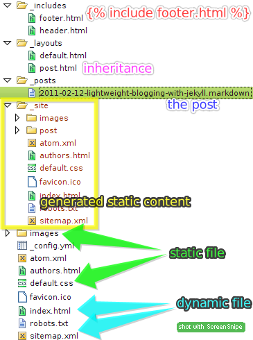

!SLIDE smbullets

# Jekyll

- static site generator
- write in Markdown or Textile
- `/_posts/2011-02-22-trug.markdown`
- simple templates with Liquid

!SLIDE smbullets

# static site is lame

- is it?
- KISS & YAGNI
- no weird servers, everything is HTML
- no one but Chuck Norris can inject SQL
- did you try theming Wordpress? sending my condolences

!SLIDE smbullets centered

!SLIDE smbullets

# templates with Liquid

- `{{ content }}`
- `{{ post.title }}`

!SLIDE smbullets

# filters

- `{{ post.date | date: "%h %Y" }}`
- `{{ post.title | upcase }}`
- `{{ post.content | truncatewords: 20 }}`

!SLIDE smbullets

# subtemplates

- ``

!SLIDE smbullets

# conditionals

- ``
- ``
- ``

!SLIDE smbullets

# for-each loop

- ``
- `<a href="{{ post.url }}"> {{ post.title }} </a>`
- ``

!SLIDE smbullets

# more about Liquid

- [https://github.com/tobi/liquid/wiki/liquid-for-designers](https://github.com/tobi/liquid/wiki/liquid-for-designers)

!SLIDE

# YAML Front Matter

    ---
    layout: post
    title: Lightweight blogging with Jekyll
    keywords: jekyll, blogging
    categories:
    - ruby
    - blog
    ---

!SLIDE 

# _config.yml

    auto:        auto
    server_port: 4000
    lsi:         true
    pygments:    false
    markdown:    maruku
    permalink:   post/:title.html
    
    hello:       Hallo Welt!
    trug:        should meet more often

!SLIDE smbullets

# let's play

